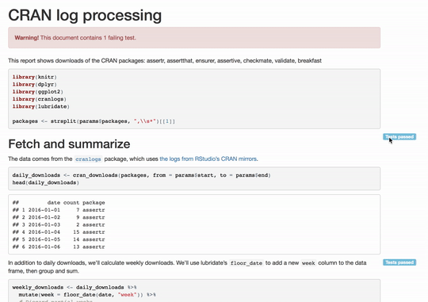

# testrmd 


`testrmd` provides facilities to enable testing of and reporting on tested
R Markdown chunks.



### Why test?

As the author of an R Markdown document, there are assumptions you make along the way: that your data is a certain shape, that certain populations are represented, that your time series doesn't have any gaps. By writing explicit tests, you can spot any violations of these assumptions earlier, and prevent readers of your document from coming to any unwarranted conclusions.

This is especially important for R Markdown documents that may be run as part of a workflow, where data may change with every render, or R package dependencies may be upgraded over the lifetime of the document. Tests let you alert readers to subtle problems long after you are done writing the document.

### Why testrmd?

Tests are just regular R code that throw errors when their expectations are broken. So you may wonder why the testrmd package is needed--why not just write tests in regular `{r}` chunks?

The primary reason is that testrmd presents a better user experience for your readers. Test code/output is generally not useful when the tests are passing, but when the tests fail, they become very important. This package makes it easy for tests to stay out of your readers' way until something actually goes wrong, at which time it calls your readers' attention to the failures.

### Installation

```r
devtools::install_github("ropenscilabs/testrmd")
```

### Basic Use

To enable testing of RMarkdown chunks in your document, you will need to add
a function calls in a chunk before you want to do testing.

```r
testrmd::init()
```

Thereafter, for any chunk that you want to have as part of the testing, you simply
need to add the option `test = TRUE` in the chunk header, and then have testing code
that returns an error if the test fails. As a simple example, let's test if
a variable is numeric:

    ```{r test_chunk, test = TRUE}
    y <- "5"
    stopifnot(is.numeric(y))
    ```

### Example Output

The [default](https://ropenscilabs.github.io/testrmd/cranlogs_default.html) and [emoji](https://ropenscilabs.github.io/testrmd/cranlogs_emoji.html) (`testrmd::init(theme = "emoji")`) examples of running
an analysis using `cranlogs` are available.

### Supported Frameworks

`testrmd` supports validation methods that throw errors when a test fails. The following validation frameworks have been shown to easily return errors compatible with `testrmd`:

* [`stopifnot`](https://stat.ethz.ch/R-manual/R-devel/library/base/html/stopifnot.html)
* [`testthat`](https://github.com/hadley/testthat) (must use `devtools::install_github("hadley/testthat#594")` for now)
* [`assertthat`](https://github.com/hadley/assertthat)
* [`assertr`](https://github.com/ropensci/assertr)
* [`ensurer`](https://github.com/smbache/ensurer)
* [`assertive`](https://bitbucket.org/richierocks/assertive)
* [`checkmate`](https://github.com/mllg/checkmate)
* [`testit`](https://github.com/yihui/testit)

#### Unconfirmed Frameworks

The following validation methods have not been confirmed to work with `testrmd` because their core functionality does not throw errors to indicate a failed test:

* [`pointblank`](https://github.com/rich-iannone/pointblank)
* [`tester`](https://github.com/gastonstat/tester)
* [`validate`](https://github.com/data-cleaning/validate)

